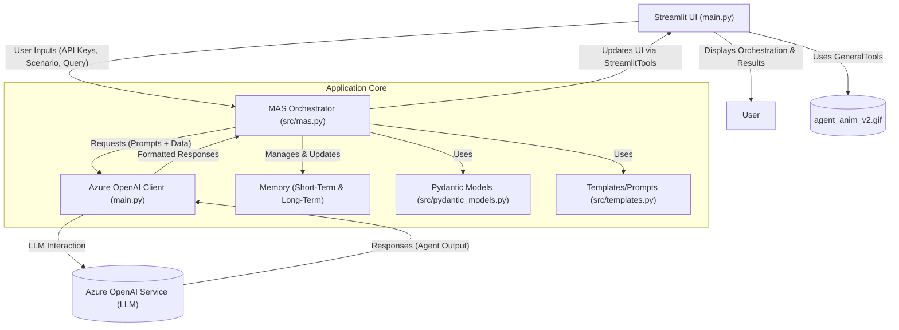
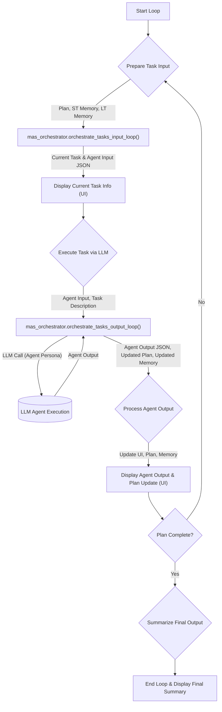
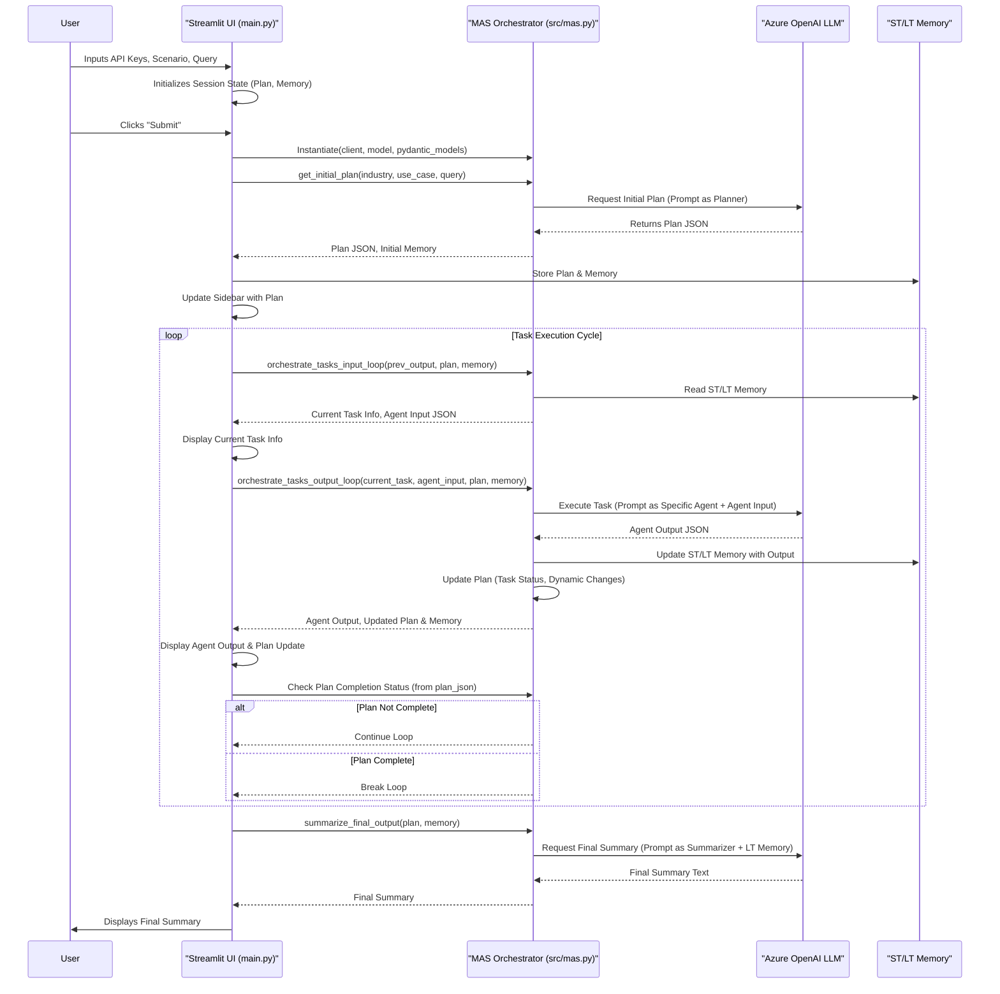

# 🎮 Multi-Agent Playground: End-to-End Explanation

## 🚀 Introduction

The **Multi-Agent Playground** project, found at `lordaouy/agent-playground`, demonstrates a sophisticated multi-agent system. It utilizes a Large Language Model (LLM), such as Azure OpenAI's GPT models, to showcase dynamic planning, task orchestration, inter-agent communication, and adaptability. Users can define an industry, a use case, and an overall query, and the system will simulate a team of AI agents collaborating to address the query.

The primary purpose of this repository is for learning and can be adapted for various needs.

## 🏛️ High-Level Architecture

The application is structured around a user interface (Streamlit), a central orchestrator, an LLM client, memory modules, and data models.



## 🧩 Core Components

1.  **Streamlit UI (`main.py`)**:
    *   The user's gateway to the system.
    *   Collects Azure OpenAI credentials, scenario details (industry, use case), and the user's primary query.
    *   Displays the orchestration process in real-time, including agent communications, the evolving plan, and the final result.

2.  **Azure OpenAI Client (`main.py`)**:
    *   Manages communication with the Azure OpenAI service.
    *   Constructed using user-provided or environment-defined API key, endpoint, and model deployment name.
    *   Sends formatted prompts to the LLM and receives its generated responses.

3.  **MAS Orchestrator (`src/mas.py`)**:
    *   The central coordinator or "brain" of the multi-agent system.
    *   Receives the user's query and contextual information.
    *   **Responsibilities**:
        *   **Initial Planning**: Interacts with the LLM to break down the user's query into a sequence of manageable tasks and identifies the types of "virtual agents" required.
        *   **Task Assignment**: Determines which agent (persona) should handle each task.
        *   **Execution Flow Management**: Controls the order of task execution.
        *   **Inter-Agent Communication Facilitation**: Manages the flow of information (outputs from one agent becoming inputs for another) via memory systems.
        *   **Dynamic Plan Adaptation**: Modifies the plan based on agent outputs and evolving information.
        *   **Memory Management**: Updates short-term and long-term memory.

4.  **Agents (Conceptual)**:
    *   These are not distinct software entities but rather different roles or "personas" that the LLM adopts based on instructions from the orchestrator.
    *   Examples: "Data Collection Agent," "Financial Analyst Agent," "Report Generation Agent."
    *   The orchestrator crafts specific prompts to make the LLM behave as the required agent for a given task.

5.  **Pydantic Models (`src/pydantic_models.py`)**:
    *   Python classes that define the structure (JSON schema) for data exchanged with the LLM.
    *   Ensures that the LLM's responses (especially for simulated function calls or structured data generation) are in a predictable and parsable format.
    *   Enables input validation and clear data contracts.

6.  **Templates (`src/templates.py`)**:
    *   Contains pre-defined string templates.
    *   Used for constructing system prompts for the LLM, instructions for agents, and potentially for formatting parts of the UI (e.g., the initial instructions markdown).

7.  **Tools (`src/tools.py`)**:
    *   **`StreamlitTools`**: A collection of functions specifically designed to interact with and update the Streamlit user interface. For example, updating the sidebar to reflect the current plan status.
    *   **`GeneralTools`**: Utility functions for general tasks, such as loading the animated GIF (`agent_anim_v2.gif`) displayed in the UI.

8.  **Memory**:
    *   **Short-Term Memory (`st_memory`)**: Holds data that is immediately relevant for the current or next task. It's dynamic and often updated or cleared as tasks progress.
    *   **Long-Term Memory (`lt_memory`)**: Accumulates key insights, decisions, and important data generated throughout the entire plan execution. It serves as a persistent knowledge base for the duration of the user's query.

## 🔄 End-to-End Workflow

The application follows a structured workflow from user input to final output:

### Step 1: Setup and Configuration (User via `main.py`)

1.  **Azure OpenAI Credentials**:
    *   The user interacts with the sidebar in the Streamlit UI.
    *   They can manually input their Azure OpenAI `API Key`, `Endpoint URL`, and `Model Name` (deployment name).
    *   Alternatively, by checking "Use Environment Key," the application attempts to load these credentials from environment variables (e.g., from a `.env` file, based on the `.env.sample` provided).
    *   An `AzureOpenAI` client instance is initialized with these credentials.
2.  **Scenario Definition**:
    *   The user inputs the `Industry` (e.g., "Healthcare") and `Use Case` (e.g., "Patient data analysis"). This provides crucial context for the LLM.
3.  **User Query**:
    *   The user enters their main request/problem statement in the "Enter your query:" field.

### Step 2: Initialization (`main.py`)

*   Before the user clicks "Submit," the application initializes its session state:
    *   `st.session_state.plan = {}` (for the current plan)
    *   `st.session_state.plan_history = []` (to store plan evolution)
    *   `st.session_state.st_memory = {}` (short-term memory)
    *   `st.session_state.lt_memory = {}` (long-term memory)
*   The initial UI (title, input field, animated GIF, instructions markdown) is rendered.

### Step 3: Submission and Initial Plan Generation (`main.py` & `MAS_orchestrator`)

1.  **Submit Action**: The user clicks the "Submit" button.
2.  **Input Validation**: The application checks if the user query and Azure OpenAI configuration are present.
3.  **UI Update**: Initial UI elements (input fields, GIF, instructions) are cleared to make way for the orchestration view.
4.  **Orchestrator Instantiation**: An instance of `MAS_orchestrator` is created, providing it with the Azure OpenAI client, model name, Pydantic models, and Streamlit UI handles.
5.  **Generating the Initial Plan**:
    *   The orchestrator's `get_initial_plan(industry, use_case, user_query)` method is called.
    *   **Internal Process**:
        *   The orchestrator crafts a detailed prompt for the LLM. This prompt includes the industry, use case, user query, and instructions for the LLM to act as a "Planner Agent."
        *   The LLM is asked to:
            *   Decompose the user's query into a series of tasks.
            *   Identify the types of "virtual agents" (e.g., "Data Analyst," "Report Writer") needed for each task.
            *   Output this plan in a structured JSON format (defined by a Pydantic model). This plan typically includes task descriptions, assigned agents, sequence, and initial status (e.g., "pending").
        *   The LLM returns the initial plan as a JSON string.
    *   The `plan_json` is parsed and stored in `st.session_state.plan`.
    *   The `StreamlitTools` are used to display this initial plan in the UI's sidebar.

### Step 4: The Orchestration Loop (`main.py` `while True:` loop)

This iterative loop is the core of task execution.



**Loop Iteration Breakdown:**

1.  **Input Preparation for Current Task**:
    *   The orchestrator (via `orchestrate_tasks_input_loop` or `orchestrate_tasks_input` for the first task) identifies the next pending task from the `plan_json`.
    *   It gathers necessary inputs: data from short-term memory (output of the previous task), relevant information from long-term memory, and task-specific parameters from the plan.
    *   This is formatted into an `agent_input_json` for the assigned LLM agent.
    *   The UI is updated to show which task is being prepared.

2.  **Agent Execution and Output Processing**:
    *   The orchestrator (via `orchestrate_tasks_output_loop` or `orchestrate_tasks_output`) manages the execution.
    *   **LLM Call**:
        *   A prompt is constructed instructing the LLM to act as the specific agent for the current task, providing it with the `agent_input_json`.
        *   The LLM is asked to return its output in a structured JSON format.
    *   **Output Reception & Parsing**: The LLM's JSON response (`agent_output_json`) is received and parsed.
    *   **Memory Update**:
        *   `st_memory_json` is updated with the current agent's output, making it available for the next agent.
        *   Key findings from `agent_output_json` are consolidated into `lt_memory_json`.
    *   **Plan Update**:
        *   The status of the current task in `plan_json` is updated (e.g., to "completed").
        *   The plan might be dynamically adjusted based on the agent's output (e.g., adding new tasks, modifying existing ones).
    *   The UI is updated to reflect the agent's output and any changes to the plan.

3.  **Loop Termination Check**:
    *   The `plan_json` is checked for an overall completion status (e.g., a field like `"Overall_execution_of_the_plan": "complete"`).
    *   If the plan is marked as complete, the loop terminates.

### Step 5: Final Summary (`main.py` & `MAS_orchestrator`)

*   Once the loop terminates due to plan completion:
    *   The orchestrator's `summarize_final_output(plan_json, st_memory_json, lt_memory_json, st_tools)` method is called.
    *   **Internal Process**:
        *   A final prompt is sent to the LLM, instructing it to act as a "Summarizer Agent."
        *   This prompt includes the completed plan, relevant information from long-term memory, and potentially key outputs from short-term memory.
        *   The LLM generates a comprehensive summary answering the original user query based on the entire multi-agent process.
    *   This `final_output` is then displayed to the user (currently printed to console, ideally rendered in the Streamlit UI).

## 📊 Control Flow Summary Diagram



##🧠 Memory Management

Effective memory management is crucial for the coherence and success of the multi-agent system.

*   **Short-Term Memory (`st_memory`)**:
    *   **Purpose**: To hold data immediately relevant to the current task or the direct transition between one task and the next. Typically contains the output of the most recently completed agent, which serves as input for the next.
    *   **Lifecycle**: Highly dynamic. It's frequently updated or overwritten as agents complete tasks. For example, Agent A's output is placed in ST memory for Agent B. Once Agent B processes it, that specific ST memory content might be replaced by Agent B's output if Agent C needs it.
    *   **Control**: Managed by the `MAS_orchestrator` during the input preparation and output processing phases of each task in the loop.

*   **Long-Term Memory (`lt_memory`)**:
    *   **Purpose**: To accumulate significant findings, decisions, synthesized data, and critical insights gathered throughout the entire execution of the plan. It provides a persistent knowledge base that any subsequent agent can draw upon, allowing for context retention across multiple steps.
    *   **Lifecycle**: Cumulative. Information is generally added and consolidated. It grows as agents contribute their findings. Less frequently modified or cleared compared to ST memory.
    *   **Control**: The `MAS_orchestrator`, after receiving an agent's output (`agent_output_json`), determines which pieces of information are valuable for long-term retention and integrates them into `lt_memory`. This memory is vital for the final summarization task and for agents that require a broader historical context.

**Decision Rationale for ST/LT Memory**: This separation prevents the immediate context for each agent (ST memory) from becoming cluttered with too much historical data, ensuring focused processing. Simultaneously, it preserves essential information over the long run (LT memory) for overall coherence and informed decision-making by later agents or the final summarizer.

## 🤔 Key Design Decisions & Rationale

*   **Using Pydantic Models for LLM I/O**:
    *   **Decision**: Define strict JSON schemas for data exchanged with the LLM.
    *   **Rationale**:
        1.  **Structured Output**: Guides the LLM to produce output in a predictable format, crucial for "simulated function calling" or any task requiring structured data.
        2.  **Validation**: Allows the application to validate the LLM's JSON response. If non-conformant, error handling or retry mechanisms can be invoked.
        3.  **Ease of Parsing**: Validated JSON can be reliably parsed into Python objects, simplifying data handling and reducing runtime errors.

*   **Dynamic Agent Creation (Agent Swarm Concept)**:
    *   **Decision**: Agents are not pre-programmed with fixed logic but are dynamically defined by prompting the LLM based on the task requirements identified in the plan.
    *   **Rationale**:
        1.  **Adaptability**: The system can handle a wide array of industries and use cases without requiring new agent code for each. The "Planner Agent" effectively "designs" the necessary specialized agents on the fly.
        2.  **Scalability**: New agent "capabilities" are essentially new prompting strategies rather than new software modules.

*   **Orchestrator-Centric Design**:
    *   **Decision**: A central `MAS_orchestrator` manages the overall workflow, task execution, and state.
    *   **Rationale**:
        1.  **Centralized Control**: Provides a single point for managing plan execution, inter-agent communication (mediated by the orchestrator and memory), and state transitions.
        2.  **State Management**: Simplifies tracking the overall progress, plan modifications, and memory updates.
        3.  **Error Handling & Recovery (Potential)**: A central orchestrator is the ideal place to implement strategies for detecting agent failures, retrying tasks, or dynamically re-planning if issues arise (though advanced error recovery is not explicitly detailed in the provided `main.py`).

*   **Iterative Loop for Task Execution**:
    *   **Decision**: Tasks are processed sequentially (or in a managed order) within a `while` loop.
    *   **Rationale**:
        1.  **Dependency Management**: Handles tasks where one step's output is an input to the next.
        2.  **Resource Control**: Manages LLM calls, preventing excessive simultaneous requests which can be costly or hit API rate limits.
        3.  **Clarity and Debuggability**: Makes the execution flow easier to understand and trace.
        4.  **Dynamic Planning**: Allows the plan to be updated by an agent's output before the subsequent agent begins its task.

*   **Streamlit for UI**:
    *   **Decision**: Utilize Streamlit for building the interactive web interface.
    *   **Rationale**:
        1.  **Rapid Prototyping**: Enables quick development and iteration of UIs directly in Python.
        2.  **Data-Centric**: Well-suited for applications involving data manipulation, visualization, and interactive elements, which are common in AI/ML projects.
        3.  **Python Integration**: Seamlessly integrates with the Python-based backend logic of the agent system.

## 🛠️ Getting Started (Summary from README.md)

### Prerequisites

*   Python 3.8+
*   Streamlit
*   Azure OpenAI API key, endpoint, and a model deployment supporting JSON schema response format.

### Installation

1.  Clone the repository:
    ```sh
    git clone https://github.com/lordaouy/agent-playground.git
    # Or if it's originally from Azure-Samples:
    # git clone https://github.com/Azure-Samples/agent-playground.git
    cd agent-playground
    ```
2.  Install dependencies:
    ```sh
    pip install -r requirements.txt
    ```

### Quickstart

1.  Run the application:
    ```sh
    streamlit run main.py
    ```
2.  Configure Azure OpenAI:
    *   Enter your Azure API key, model name, and endpoint in the sidebar.
    *   Alternatively, create a `.env` file from `.env.sample` and populate it with your credentials, then check "Use Environment Key".
3.  Define Scenario and Query:
    *   Input the industry, use case, and your overall query.
    *   Click **Submit** to start the multi-agent process.
4.  Monitor:
    *   The **right sidebar** displays the orchestration plan and its status.
    *   The **middle section** (once inputs are submitted) visualizes agent communication and information exchange (as described by the print statements in `main.py`, which would ideally be rendered into dedicated UI components).

This comprehensive explanation should provide a thorough understanding of the Multi-Agent Playground's architecture, workflow, and underlying principles.
