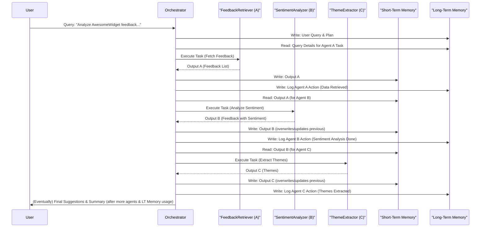

# 🧠 In-Depth Memory Management: ST/LT Read & Write Operations

In the `lordaouy/agent-playground`, the effective management of Short-Term (ST) and Long-Term (LT) memory is pivotal for the multi-agent system's ability to process information, maintain context, and achieve complex goals. The `MAS_orchestrator` is central to these operations.

## Core Principles

*   **ST Memory (`st_memory_json`)**:
    *   **Purpose**: Holds data for immediate use—typically the output of the last agent, serving as direct input for the next. It's a "working scratchpad."
    *   **Nature**: Dynamic, transient, frequently overwritten or updated.
*   **LT Memory (`lt_memory_json`)**:
    *   **Purpose**: Accumulates significant findings, decisions, and synthesized knowledge over the entire task lifecycle. It's the "project archive" or "knowledge base."
    *   **Nature**: Persistent (for the duration of the overall query), cumulative, grows over time.

## Orchestrator's Role in Memory Operations

The `MAS_orchestrator`'s methods (like `get_initial_plan`, `orchestrate_tasks_input_loop`, `orchestrate_tasks_output_loop`) internally handle the logic for reading from and writing to these memory stores.

---

## Example Scenario: "Customer Feedback Analysis"

Let's trace memory operations with a hypothetical user query:
**User Query**: *"Analyze customer feedback for 'AwesomeWidget' from Q1 2025 and suggest 3 key areas for improvement."*
**Current Date (for context)**: 2025-04-10

**Assumed Agents in the Plan:**
1.  **FeedbackRetriever (Agent A)**: Fetches feedback.
2.  **SentimentAnalyzer (Agent B)**: Analyzes sentiment.
3.  **ThemeExtractor (Agent C)**: Extracts themes from negative/neutral feedback.
4.  **SuggestionGenerator (Agent D)**: Generates improvement suggestions.

### Phase 0: Initialization (Conceptual `get_initial_plan`)

Before any agent runs, the `MAS_orchestrator`, through its `get_initial_plan` method, sets up the initial memory states after parsing the user query and forming a plan.

*   **Initial ST Memory (`st_memory_json`)**:
    *   Often starts empty or with minimal data, like the first task's input if immediately available. For simplicity, let's assume it's initially empty after planning, and the first agent's input is derived from the plan and LT memory.
    ```json
    {}
    ```

*   **Initial LT Memory (`lt_memory_json`)**:
    *   The user query and the generated plan outline are logged.
    ```json
    [
      {
        "timestamp": "2025-04-10T10:00:00Z",
        "source_agent": "SystemInput",
        "type": "user_query_received",
        "data": {
          "query": "Analyze customer feedback for 'AwesomeWidget' from Q1 2025 and suggest 3 key areas for improvement."
        }
      },
      {
        "timestamp": "2025-04-10T10:00:05Z",
        "source_agent": "PlannerAgent",
        "type": "plan_generated",
        "data": {
          "task_1": "Retrieve feedback for AwesomeWidget, Q1 2025",
          "task_2": "Analyze sentiment of retrieved feedback",
          "task_3": "Extract themes from negative/neutral feedback",
          "task_4": "Generate 3 improvement suggestions"
        }
      }
    ]
    ```

---

### Phase 1: Agent A - FeedbackRetriever

**Task**: "Retrieve feedback for AwesomeWidget, Q1 2025"

**1.A. Memory Read Operations (Conceptual - within `orchestrate_tasks_input_loop`)**

The orchestrator prepares input for `FeedbackRetriever (Agent A)`.

*   **Reading from ST Memory**:
    *   `st_memory_json` is currently `{}` (or contains data not directly relevant as primary input for Agent A's core task of fetching). The orchestrator sees there's no direct "previous agent output" to pass.
*   **Reading from LT Memory**:
    *   The orchestrator accesses `lt_memory_json` to get context for Agent A's task.
    *   It would read entries like:
        *   `user_query_received`: To understand "AwesomeWidget" and "Q1 2025".
        *   `plan_generated`: To confirm Agent A's specific task.
    *   **Conceptual Logic**:
        ```python
        # Inside orchestrator, preparing for Agent A
        task_details_for_A = get_task_from_plan("task_1") # "Retrieve feedback for AwesomeWidget, Q1 2025"
        # No specific data from ST memory needed as primary input for fetching
        # LT memory provides the necessary context (product name, period)
        agent_A_input = {"task_description": task_details_for_A, "product_name": "AwesomeWidget", "period": "Q1 2025"}
        ```

**(Agent A executes its task - LLM simulates fetching feedback and returns output)**
Let's say Agent A's output (`agent_A_output_json`) is:
```json
{
  "status": "success",
  "retrieved_feedback_count": 2,
  "feedback_items": [
    {"id": "fb_001", "text": "AwesomeWidget is amazing, love the new UI!", "date": "2025-01-15"},
    {"id": "fb_002", "text": "The price is a bit high for AwesomeWidget.", "date": "2025-02-20"}
  ]
}
```

**1.B. Memory Write Operations (Conceptual - within `orchestrate_tasks_output_loop`)**

The orchestrator processes Agent A's output.

*   **Writing to ST Memory**:
    *   The output of Agent A is placed into `st_memory_json` to be readily available for the next agent (SentimentAnalyzer).
    *   `st_memory_json` becomes:
        ```json
        // st_memory_json after Agent A
        {
          "last_agent_output": { // Key indicating this is fresh output
            "agent_name": "FeedbackRetriever",
            "status": "success",
            "retrieved_feedback_count": 2,
            "feedback_items": [
              {"id": "fb_001", "text": "AwesomeWidget is amazing, love the new UI!", "date": "2025-01-15"},
              {"id": "fb_002", "text": "The price is a bit high for AwesomeWidget.", "date": "2025-02-20"}
            ]
          }
        }
        ```
*   **Writing to LT Memory**:
    *   A summary of Agent A's action and findings is logged.
    *   `lt_memory_json` (appended entry):
        ```json
        // lt_memory_json after Agent A (new entry added)
        [
          // ... previous entries ...
          {
            "timestamp": "2025-04-10T10:05:00Z",
            "source_agent": "FeedbackRetriever",
            "type": "data_retrieval_complete",
            "data": {
              "summary": "Retrieved 2 feedback items for AwesomeWidget, Q1 2025.",
              "retrieved_count": 2
            }
          }
        ]
        ```

---

### Phase 2: Agent B - SentimentAnalyzer

**Task**: "Analyze sentiment of retrieved feedback"

**2.A. Memory Read Operations (Conceptual - within `orchestrate_tasks_input_loop`)**

*   **Reading from ST Memory**:
    *   The orchestrator reads `st_memory_json` to get Agent A's output.
    *   **Conceptual Logic**:
        ```python
        # Inside orchestrator, preparing for Agent B
        agent_A_output = st_memory_json.get("last_agent_output")
        if agent_A_output and agent_A_output.get("agent_name") == "FeedbackRetriever":
            feedback_to_analyze = agent_A_output.get("feedback_items")
            agent_B_input = {"feedback_data": feedback_to_analyze, "task_description": "Analyze sentiment"}
        else:
            # Handle error: expected output not found
            pass
        ```
*   **Reading from LT Memory**:
    *   Generally, for a focused task like sentiment analysis on provided data, direct LT memory access might be minimal, unless the agent needs broader context (e.g., specific sentiment scales defined earlier in the project, which is not the case here). The task itself is clear from the plan.

**(Agent B executes - LLM analyzes sentiment and returns output)**
Let's say Agent B's output (`agent_B_output_json`) is:
```json
{
  "status": "success",
  "analyzed_feedback_count": 2,
  "feedback_with_sentiment": [
    {"id": "fb_001", "text": "AwesomeWidget is amazing, love the new UI!", "sentiment": "positive", "score": 0.9},
    {"id": "fb_002", "text": "The price is a bit high for AwesomeWidget.", "sentiment": "negative", "score": -0.6}
  ]
}
```

**2.B. Memory Write Operations (Conceptual - within `orchestrate_tasks_output_loop`)**

*   **Writing to ST Memory**:
    *   Agent B's output overwrites/updates the `last_agent_output` in `st_memory_json`.
    *   `st_memory_json` becomes:
        ```json
        // st_memory_json after Agent B
        {
          "last_agent_output": {
            "agent_name": "SentimentAnalyzer",
            "status": "success",
            "analyzed_feedback_count": 2,
            "feedback_with_sentiment": [
              {"id": "fb_001", "text": "AwesomeWidget is amazing, love the new UI!", "sentiment": "positive", "score": 0.9},
              {"id": "fb_002", "text": "The price is a bit high for AwesomeWidget.", "sentiment": "negative", "score": -0.6}
            ]
          }
        }
        ```
*   **Writing to LT Memory**:
    *   Summary of sentiment analysis is logged.
    *   `lt_memory_json` (appended entry):
        ```json
        // lt_memory_json after Agent B (new entry added)
        [
          // ... previous entries ...
          {
            "timestamp": "2025-04-10T10:10:00Z",
            "source_agent": "SentimentAnalyzer",
            "type": "sentiment_analysis_complete",
            "data": {
              "summary": "Analyzed 2 feedback items. Positive: 1, Negative: 1.",
              "positive_count": 1,
              "negative_count": 1,
              "neutral_count": 0
            }
          }
        ]
        ```

---

### Phase 3: Agent C - ThemeExtractor

**Task**: "Extract themes from negative/neutral feedback"

**3.A. Memory Read Operations (Conceptual - within `orchestrate_tasks_input_loop`)**

*   **Reading from ST Memory**:
    *   Orchestrator reads `st_memory_json` for Agent B's output.
    *   **Conceptual Logic**:
        ```python
        # Inside orchestrator, preparing for Agent C
        agent_B_output = st_memory_json.get("last_agent_output")
        if agent_B_output and agent_B_output.get("agent_name") == "SentimentAnalyzer":
            feedback_with_sentiment = agent_B_output.get("feedback_with_sentiment")
            # Filter for negative/neutral feedback for Agent C
            negative_neutral_feedback = [item for item in feedback_with_sentiment if item.get("sentiment") in ["negative", "neutral"]]
            agent_C_input = {"feedback_to_theme": negative_neutral_feedback, "task_description": "Extract themes"}
        else:
            # Handle error
            pass
        ```
*   **Reading from LT Memory**:
    *   The orchestrator might check LT memory for the original query if Agent C needs to ensure themes are relevant to "AwesomeWidget" specifically, or if there are pre-defined categories of themes for this project (not assumed here).

**(Agent C executes - LLM extracts themes and returns output)**
Let's say Agent C's output (`agent_C_output_json`) is:
```json
{
  "status": "success",
  "analyzed_item_count": 1, // Only one negative feedback
  "extracted_themes": [
    {"theme": "PricingConcern", "mentions": 1, "example_feedback_ids": ["fb_002"]}
  ]
}
```

**3.B. Memory Write Operations (Conceptual - within `orchestrate_tasks_output_loop`)**

*   **Writing to ST Memory**:
    *   Agent C's output updates `st_memory_json`.
    *   `st_memory_json` becomes:
        ```json
        // st_memory_json after Agent C
        {
          "last_agent_output": {
            "agent_name": "ThemeExtractor",
            "status": "success",
            "extracted_themes": [
              {"theme": "PricingConcern", "mentions": 1, "example_feedback_ids": ["fb_002"]}
            ]
          }
        }
        ```
*   **Writing to LT Memory**:
    *   Key themes are logged.
    *   `lt_memory_json` (appended entry):
        ```json
        // lt_memory_json after Agent C (new entry added)
        [
          // ... previous entries ...
          {
            "timestamp": "2025-04-10T10:15:00Z",
            "source_agent": "ThemeExtractor",
            "type": "theme_extraction_complete",
            "data": {
              "summary": "Extracted 1 theme from negative/neutral feedback.",
              "themes_identified": ["PricingConcern"]
            }
          }
        ]
        ```

---

This process would continue for Agent D (SuggestionGenerator), which would read themes from ST Memory (output of Agent C) and potentially the original goal from LT Memory, and then write its suggestions to ST and LT Memory. Finally, a Summarizer agent would heavily rely on the accumulated LT Memory to provide the final answer.

## Mermaid Diagram: Memory Interaction for Scenario



This detailed scenario illustrates the dynamic interplay between ST and LT memory, orchestrated by the `MAS_orchestrator`, enabling a structured, step-by-step approach to complex problem-solving. ST memory facilitates the direct flow between sequential agents, while LT memory builds a comprehensive record and knowledge base.
