# Understanding the Multi-Agent Playground (`lordaouy/agent-playground`)

**Current Date and Time (UTC):** 2025-06-09 22:21:10
**User:** lordaouy

## I. Introduction

The **Multi-Agent Playground** project is a Streamlit web application designed to showcase and simulate a multi-agent system. It leverages a Large Language Model (LLM), specifically Azure OpenAI, to dynamically generate plans, orchestrate tasks, and simulate the actions of various AI agents collaborating to address a user's complex query. The system highlights capabilities like task decomposition, dynamic planning (conceptual), inter-agent communication via memory, and structured data handling through Pydantic models.

The core idea is not to run truly independent agent processes but to use a single LLM that adopts different "personas" or roles (agents) based on carefully constructed prompts managed by an orchestrator.

## II. Core Components

The application is built from several key Python scripts and concepts:

1.  **`main.py` (Streamlit UI & Application Driver)**:
    *   Provides the web interface using Streamlit.
    *   Collects user inputs (Azure credentials, scenario details, query).
    *   Manages the application's session state (`st.session_state`), which is crucial for storing the plan, memory, and chat history across UI interactions.
    *   Initiates the multi-agent orchestration process when the user submits a query.
    *   Displays the ongoing plan, agent actions, and final results.

2.  **`src/mas.py` (`MAS_orchestrator` class)**:
    *   The "brain" of the multi-agent system.
    *   Contains the `MAS_orchestrator` class responsible for:
        *   Interacting with the Azure OpenAI LLM.
        *   Generating an initial plan (sequence of tasks and agents) based on the user's query and context.
        *   Executing the plan task by task, prompting the LLM to act as the designated agent for each step.
        *   Managing and updating short-term and long-term memory based on LLM outputs.
        *   Formatting messages for display in the UI.

3.  **`src/pydantic_models.py`**:
    *   Defines Python classes using Pydantic (e.g., `Plan`, `Task`, `AgentOutput`).
    *   These models are used to generate JSON schemas (`.model_json_schema()`).
    *   These schemas are embedded into prompts sent to the LLM to ensure its responses (plans, agent outputs, memory updates) are in a predictable, structured JSON format that the Python code can reliably parse and use.

4.  **`src/templates.py`**:
    *   Contains string templates, including:
        *   HTML/Markdown for UI elements (like the introductory text).
        *   The detailed system prompt templates used by `MAS_orchestrator` to instruct the LLM for planning and task execution.

5.  **`src/tools.py` (`StreamlitTools`, `GeneralTools`)**:
    *   `StreamlitTools`: Contains utility functions for updating the Streamlit UI, especially the sidebar that displays the plan's progress.
    *   `GeneralTools`: Provides general helper functions, like loading and encoding the animated GIF displayed on the main page.

6.  **Azure OpenAI LLM**:
    *   The underlying intelligence. It doesn't just answer questions but acts as:
        *   A **Planner**: Generates the initial multi-step plan.
        *   Multiple **Specialized Agents**: Adopts different roles (e.g., DataRetrieverAgent, SalesAnalyticsAgent) to "execute" individual tasks by generating synthetic data or analyses.
        *   An **Orchestration Assistant**: Helps update the plan status and memory as part of its response during task execution.

7.  **Memory (`st.session_state.st_memory`, `st.session_state.lt_memory`)**:
    *   **Short-Term Memory (`st_memory`)**: A dictionary holding data immediately relevant for the current or next task. Typically, it stores the output of the most recently completed agent, which serves as direct input for the subsequent agent.
    *   **Long-Term Memory (`lt_memory`)**: A dictionary (often structured like a list of event logs) that accumulates key insights, decisions, a history of agent actions, and important data generated throughout the entire plan execution. It provides a persistent context for the overall query.

## III. Detailed End-to-End Workflow with Examples

Let's walk through a scenario:
*   **User Query**: "Analyze sales data for Q1 2025 for 'Product X' and identify top 3 performing regions."
*   **Industry**: "Retail"
*   **Use Case**: "Sales Analysis"

### A. Phase 1: Setup & User Input (`main.py`)

1.  **Azure OpenAI Configuration**:
    The user navigates to the application. In the sidebar, they input their Azure OpenAI API Key, Endpoint URL, and Model Name, or they check "Use Environment Key" to load these from environment variables.
    ```python
    // main.py (conceptual snippet)
    api_key = st.text_input("API Key", type="password", key="api_key")
    endpoint = st.text_input("Endpoint URL", key="endpoint_url")
    deployment_name = st.text_input("Model Name", key="model_name")
    use_environment_key = st.checkbox("Use Environment Key", key="use_environment_key", value=True)

    if use_environment_key:
        client = AzureOpenAI(azure_endpoint=os.getenv('AZURE_OPENAI_ENDPOINT'), ...)
    else:
        client = AzureOpenAI(azure_endpoint=endpoint, api_key=api_key, ...)
    ```

2.  **Scenario Definition**:
    The user specifies the context for their query.
    *   Industry: "Retail"
    *   Use Case: "Sales Analysis"
    ```python
    // main.py
    industry = st.text_input("Industry", placeholder="e.g., Healthcare, Finance", key="industry")
    use_case = st.text_input("Use Case", placeholder="e.g., Chatbot, Data Analysis", key="use_case")
    ```

3.  **User Query**:
    The user types their main request.
    *   Query: "Analyze sales data for Q1 2025 for 'Product X' and identify top 3 performing regions."
    ```python
    // main.py
    user_query = input_placeholder.text_input("Enter your query:", "", key="user_query")
    ```

4.  **Session State Initialization**:
    If this is the first interaction or the page was reloaded, `main.py` initializes necessary variables in `st.session_state`.
    ```python
    // main.py
    if 'plan' not in st.session_state:
        st.session_state.plan = {}           // To store the current multi-step plan
        st.session_state.plan_history = []   // To store previous versions of the plan (if needed)
        st.session_state.st_memory = {}      // Short-term memory, initially empty
        st.session_state.lt_memory = {}      // Long-term memory, initially empty
        # st_tools = StreamlitTools().update_sidebar(st.session_state.plan, st, sidebar_placeholder) // Initial sidebar update
    if 'chat_history' not in st.session_state:
        st.session_state.chat_history = []   // For displaying the conversation flow
    ```

### B. Phase 2: Initial Plan Generation (User Clicks "Submit")

This phase is orchestrated by `main.py` calling methods in the `MAS_orchestrator` class (`src/mas.py`).

1.  **Trigger**: The user clicks the "Submit" button.
    ```python
    // main.py
    submit_clicked = button_placeholder.button("Submit")
    if __name__ == "__main__":
        if submit_clicked:
            # ... (input validation) ...
            title_placeholder.empty() # Clear initial UI elements
            # ...
    ```

2.  **Orchestrator Instantiation**: An instance of `MAS_orchestrator` is created.
    ```python
    // main.py
    mas_orchestrator = MAS_orchestrator(client, model_name, pydantic_models, st, sidebar_placeholder)
    ```

3.  **Call `get_initial_plan`**:
    `main.py` invokes `mas_orchestrator.get_initial_plan()` with the user's inputs.
    ```python
    // main.py
    plan_json, st_memory_json, lt_memory_json = mas_orchestrator.get_initial_plan(industry, use_case, user_query)
    ```
    *   **Inside `get_initial_plan` (`src/mas.py`)**:
        *   **Prompt Construction**: A detailed system prompt is constructed. This prompt instructs the LLM to act as a "Master Planner." It includes:
            *   The user's `industry`, `use_case`, and `user_query`.
            *   A request for the output to be a JSON object strictly adhering to the schema defined by `pydantic_models.Plan.model_json_schema()`. This schema dictates the structure for tasks, agent assignments, descriptions, dependencies, and initial memory states.
            *   Example instruction: "Based on the provided industry, use case, and user query, generate a comprehensive, step-by-step execution plan. Define each task, the agent responsible, its function, inputs, and expected outputs. Structure your entire response as a single JSON object conforming to the provided schema. Initialize `st_memory` as an empty object and `lt_memory` with an initial event logging the query reception and plan generation."
        *   **LLM Interaction**: The prompt is sent to the Azure OpenAI LLM.
        *   **LLM Response & Parsing**: The LLM processes the request and returns a JSON string. `MAS_orchestrator` parses this string.

            **Example `plan_json` (conceptual, as returned by LLM and parsed):**
            ```json
            {
              "plan_details": {
                "user_query": "Analyze sales data for Q1 2025 for 'Product X' and identify top 3 performing regions.",
                "overall_goal": "Identify and report the top 3 performing regions for 'Product X' in Q1 2025 based on sales data.",
                "plan_status": "Not Started",
                "overall_summary": ""
              },
              "tasks": [
                {
                  "task_id": "T1", "task_name": "Fetch Sales Data", "agent_name": "DataRetrieverAgent",
                  "agent_function": "fetch_product_sales_q1_2025",
                  "description": "Retrieve raw sales data for 'Product X' for Q1 2025.", "status": "Not Started",
                  "depends_on": [], "inputs_from_st_memory": [],
                  "output_description": "JSON: list of sales records [{region, units_sold, revenue}].",
                  "task_output": null, "task_output_observation": null
                },
                {
                  "task_id": "T2", "task_name": "Aggregate Sales by Region", "agent_name": "DataAggregationAgent",
                  "agent_function": "aggregate_sales_by_region",
                  "description": "Aggregate raw sales data to calculate total units and revenue per region.", "status": "Not Started",
                  "depends_on": ["T1"], "inputs_from_st_memory": ["T1.sales_records"],
                  "output_description": "JSON: {region: {total_units, total_revenue}}.",
                  "task_output": null, "task_output_observation": null
                },
                {
                  "task_id": "T3", "task_name": "Identify Top Performing Regions", "agent_name": "SalesAnalyticsAgent",
                  "agent_function": "find_top_regions",
                  "description": "Identify top 3 regions by total revenue.", "status": "Not Started",
                  "depends_on": ["T2"], "inputs_from_st_memory": ["T2.aggregated_sales"],
                  "output_description": "JSON: list of top 3 regions [{region, total_revenue, rank}].",
                  "task_output": null, "task_output_observation": null
                },
                {
                  "task_id": "T4", "task_name": "Generate Report", "agent_name": "ReportGeneratorAgent",
                  "agent_function": "compile_sales_report",
                  "description": "Compile a summary report.", "status": "Not Started",
                  "depends_on": ["T3"], "inputs_from_st_memory": ["T3.top_regions"],
                  "output_description": "Markdown formatted report string.",
                  "task_output": null, "task_output_observation": null
                }
              ],
              "st_memory": {},
              "lt_memory": {
                "events": [
                  {"timestamp": "2025-06-09T22:25:00Z", "type": "query_received", "detail": "User query: Analyze sales data..."},
                  {"timestamp": "2025-06-09T22:25:05Z", "type": "plan_generated", "detail": "Initial 4-task plan created."}
                ]
              }
            }
            ```

4.  **State Update (`main.py`)**: The parsed JSON objects are stored in Streamlit's session state.
    ```python
    // main.py
    st.session_state.plan = plan_json
    st.session_state.st_memory = plan_json.get('st_memory', {}) // Or st_memory_json from orchestrator
    st.session_state.lt_memory = plan_json.get('lt_memory', {}) // Or lt_memory_json from orchestrator
    ```

5.  **UI Update (`main.py` -> `src/tools.py` and `src/mas.py`)**:
    *   The plan is displayed in the sidebar:
        ```python
        // main.py
        st_tools = StreamlitTools()
        st_tools.update_sidebar(st.session_state.plan, st, sidebar_placeholder)
        ```
        This tool iterates through `st.session_state.plan['tasks']` and shows each task's name, assigned agent, and current status (initially "Not Started").
    *   An initial message about the plan is shown in the main chat area:
        ```python
        // main.py
        user_message = mas_orchestrator.get_initial_plan_message(plan_json, st_memory_json, lt_memory_json, st_tools)
        # This message is then typically displayed using st.chat_message and st.markdown
        ```

### C. Phase 3: Task Execution Loop

The system now iterates through the tasks defined in `st.session_state.plan`. `main.py` calls methods in `MAS_orchestrator` (like `orchestrate_tasks_input` and `orchestrate_tasks_output`) to manage each step.

Let's trace **Task T1: Fetch Sales Data**:

1.  **Initiate Task Execution (Conceptual call from `main.py` to `MAS_orchestrator`)**:
    ```python
    // main.py (conceptual flow within the submit block)
    current_task_json, agent_input_json, plan_json_updated_by_llm, st_memory_json_updated_by_llm, lt_memory_json_updated_by_llm = \
        mas_orchestrator.orchestrate_tasks_input(st.session_state.plan, st.session_state.st_memory, st.session_state.lt_memory)
    // ... then state is updated, and output message is generated and shown ...
    ```
    *   **Inside `orchestrate_tasks_input` (`src/mas.py`)**:
        *   **Identify Current Task**: The orchestrator determines that T1 ("Fetch Sales Data") is the next "Not Started" task.
        *   **Prompt Construction**: A highly specific system prompt is created for the LLM to act as `DataRetrieverAgent`. This prompt includes:
            *   **Role Definition**: "You are the `DataRetrieverAgent`. Your assigned function is `fetch_product_sales_q1_2025`."
            *   **Current Task Object**: The JSON object for T1 from the plan.
            *   **Agent Input**: Specific derived inputs for this agent, e.g., `{"product_name": "Product X", "target_quarter": "Q1 2025"}`. This might be extracted from the overall query or task description.
            *   **Full Plan**: The entire current `st.session_state.plan` JSON.
            *   **Current Short-Term Memory**: `st.session_state.st_memory` (empty for T1).
            *   **Current Long-Term Memory**: `st.session_state.lt_memory`.
            *   **Output Instructions**: "Execute your task. Your primary output (`Agent_Output.agent_output`) MUST be synthetic JSON data representing sales records: `[{region, units_sold, revenue}, ...]`. You MUST also return the updated `Plan` (reflecting T1's completion and its `task_output`), the updated `Short-Term Memory` (containing your `Agent_Output.agent_output` under a key like `T1.sales_records`), and the updated `Long-Term Memory` (with a new event logging this action). Adhere strictly to the provided JSON structure for your entire response."
        *   **LLM Interaction**: The prompt is sent to Azure OpenAI.
        *   **LLM Response & Parsing**: The LLM returns a large JSON object containing all the requested updated sections.

            **Example sections from LLM's response for T1:**
            *   `Agent_Output` section:
                ```json
                {
                  "Agent_Output": {
                    "agent_output": [
                      {"region": "North", "units_sold": 120, "revenue": 12000},
                      {"region": "South", "units_sold": 80, "revenue": 8000},
                      {"region": "East", "units_sold": 150, "revenue": 15000}
                    ],
                    "Agent": "DataRetrieverAgent",
                    "Agent Function": "fetch_product_sales_q1_2025"
                  }
                }
                ```
            *   `Plan` section (updated part for T1):
                ```json
                // ... within tasks list ...
                {
                  "task_id": "T1", /* ... */ "status": "Successful",
                  "task_output": {"summary": "Retrieved 3 sales records.", "st_memory_key": "T1.sales_records"},
                  "task_output_observation": "Simulated fetching sales data for Product X Q1 2025."
                }
                ```
            *   `Short-Term Memory` section (updated):
                ```json
                {
                  "T1.sales_records": [ // Key for next agent to use
                    {"region": "North", "units_sold": 120, "revenue": 12000},
                    {"region": "South", "units_sold": 80, "revenue": 8000},
                    {"region": "East", "units_sold": 150, "revenue": 15000}
                  ],
                  "last_agent_executed": "DataRetrieverAgent",
                  "last_task_id": "T1"
                }
                ```
            *   `Long-Term Memory` section (appended event):
                ```json
                {
                  "events": [
                    /* ... previous events ... */
                    {"timestamp": "2025-06-09T22:26:10Z", "type": "agent_task_execution", "agent": "DataRetrieverAgent", "task_id": "T1", "status": "Successful", "summary": "Fetched 3 sales records."}
                  ]
                }
                ```
        *   The orchestrator parses these individual JSON sections from the LLM's single, large JSON response.

2.  **State Update (`main.py` context, after `orchestrate_tasks_input` returns):**
    *   `st.session_state.plan` is updated with the `Plan` section from LLM.
    *   `st.session_state.st_memory` is updated with the `Short-Term Memory` section.
    *   `st.session_state.lt_memory` is updated with the `Long-Term Memory` section.

3.  **UI Update**:
    *   The sidebar is refreshed by `st_tools.update_sidebar(...)`, now showing T1 as "Successful".
    *   A message summarizing T1's execution (e.g., "DataRetrieverAgent successfully fetched sales data.") is displayed in the chat area, potentially including the `agent_output` or its summary. This is formatted by `mas_orchestrator.orchestrate_tasks_output_message(...)` (or similar).

**Iteration for Task T2: Aggregate Sales by Region**:

1.  The orchestrator identifies T2 as the next task.
2.  **Prompt Construction for `DataAggregationAgent`**:
    *   Crucially, the `##Short-Term Memory` section of the prompt will now contain the output of T1 (`{"T1.sales_records": [...]}`).
    *   The instructions will guide the `DataAggregationAgent` to use `T1.sales_records` from ST memory as its primary input.
3.  **LLM as `DataAggregationAgent`**:
    *   "Reads" `T1.sales_records` from its prompt's ST memory section.
    *   Simulates data aggregation.
    *   Generates its `Agent_Output` (e.g., `{"North": {"total_units": 120, ...}}`).
    *   Updates the `Plan` (T2 status, `task_output` with key `T2.aggregated_sales`).
    *   Updates `Short-Term Memory` to include `{"T2.aggregated_sales": {aggregation_result}}`. The LLM might decide if `T1.sales_records` is still needed in ST memory or can be dropped.
    *   Updates `Long-Term Memory` with a log for T2's completion.
4.  **State & UI Updates**: Similar to T1, reflecting T2's completion and output.

This cycle repeats for T3 (SalesAnalyticsAgent) and T4 (ReportGeneratorAgent).
*   `SalesAnalyticsAgent` (T3) will use `T2.aggregated_sales` from ST Memory.
*   `ReportGeneratorAgent` (T4) will use `T3.top_regions` from ST Memory and might also be prompted to review `lt_memory` for the original user query to ensure the report is well-aligned. Its output will be a Markdown string.

### D. Phase 4: Plan Completion

1.  After T4 (the final task) is successfully executed, the LLM (during its last "orchestration" response for T4) updates the main `plan_details.plan_status` in the `Plan` JSON to "Successful". It might also populate `plan_details.overall_summary`.
2.  The UI (sidebar and chat) reflects that all tasks are complete.
3.  The final output, typically the result from the last agent (e.g., the report string from `ReportGeneratorAgent`), is presented prominently to the user.

## IV. Detailed Mermaid Diagram

This diagram illustrates the detailed sequence of operations and data flow:

```mermaid
sequenceDiagram
    actor User
    participant MAIN_PY as "main.py (Streamlit UI & State)"
    participant MAS_ORCH as "MAS_orchestrator (src/mas.py)"
    participant LLM_AZURE as "Azure OpenAI LLM"
    participant ST_MEM as "st.session_state.st_memory"
    participant LT_MEM as "st.session_state.lt_memory"
    participant PLAN_STATE as "st.session_state.plan"
    participant UI_SIDEBAR as "UI Sidebar (via StreamlitTools)"
    participant UI_CHAT as "UI Chat Area"

    %% Phase 1 & 2: Setup, Input, and Initial Plan Generation
    User->>MAIN_PY: 1. Enters Config, Scenario (Industry/Use Case), Query
    MAIN_PY->>MAIN_PY: 2. Initializes st.session_state (plan, st_mem, lt_mem) if first run

    User->>MAIN_PY: 3. Clicks "Submit" button
    MAIN_PY->>MAS_ORCH: 4. Instantiate MAS_orchestrator(AzureClient, model, pydantic_models, st_obj, sidebar_ref)
    activate MAS_ORCH

    MAIN_PY->>MAS_ORCH: 5. Call get_initial_plan(industry, use_case, query)
    MAS_ORCH->>LLM_AZURE: 6. Construct & Send Prompt for Initial Plan (System Prompt + User Inputs + Plan JSON Schema)
    activate LLM_AZURE
    LLM_AZURE-->>MAS_ORCH: 7. Return JSON: {initial_plan_structure, initial_st_memory, initial_lt_memory}
    deactivate LLM_AZURE
    MAS_ORCH-->>MAIN_PY: 8. Return parsed plan_json, st_memory_json, lt_memory_json
    deactivate MAS_ORCH

    MAIN_PY->>PLAN_STATE: 9. Update st.session_state.plan = plan_json
    MAIN_PY->>ST_MEM: 10. Update st.session_state.st_memory = st_memory_json
    MAIN_PY->>LT_MEM: 11. Update st.session_state.lt_memory = lt_memory_json

    MAIN_PY->>UI_SIDEBAR: 12. Display initial plan tasks & statuses (via StreamlitTools)
    MAIN_PY->>UI_CHAT: 13. Display initial plan info to user (via MAS_orchestrator.get_initial_plan_message)

    %% Phase 3: Task Execution Loop (Iterative)
    loop For each Task (T_current) in st.session_state.plan.tasks
        Note over MAIN_PY, MAS_ORCH: Identify T_current as next pending task
        MAIN_PY->>MAS_ORCH: 14. Call orchestrate_tasks_input(current_plan, current_st_mem, current_lt_mem)
        activate MAS_ORCH

        MAS_ORCH->>LLM_AZURE: 15. Construct & Send Prompt for Task Execution (System Prompt for Agent_N for T_current + T_current_details + current_plan_json + current_st_mem_json + current_lt_mem_json + Output Schemas for Agent_Output, PlanUpdate, ST_MemUpdate, LT_MemUpdate)
        activate LLM_AZURE
        LLM_AZURE-->>MAS_ORCH: 16. Return single large JSON containing all updated sections: {Agent_Output_Data, Updated_Plan_Json (T_current status/output), Updated_ST_Memory_Json, Updated_LT_Memory_Json}
        deactivate LLM_AZURE
        MAS_ORCH-->>MAIN_PY: 17. Return parsed agent_output, updated_plan_json, updated_st_mem_json, updated_lt_mem_json
        deactivate MAS_ORCH

        MAIN_PY->>PLAN_STATE: 18. Update st.session_state.plan = updated_plan_json
        MAIN_PY->>ST_MEM: 19. Update st.session_state.st_memory = updated_st_mem_json (output of Agent_N becomes available)
        MAIN_PY->>LT_MEM: 20. Update st.session_state.lt_memory = updated_lt_mem_json (log Agent_N's action)

        MAIN_PY->>UI_SIDEBAR: 21. Refresh task statuses for T_current (and others if changed by LLM)
        MAIN_PY->>UI_CHAT: 22. Display Agent_N's output/summary for T_current (via MAS_orchestrator.orchestrate_tasks_output_message)
    end

    %% Phase 4: Plan Completion
    Note over MAIN_PY, UI_CHAT: When plan_details.plan_status in st.session_state.plan is "Successful"
    MAIN_PY->>User: 23. Final Output/Report (typically from the last agent) is prominently displayed.
```



## V. Conclusion

The Multi-Agent Playground effectively demonstrates a sophisticated simulation of an agentic workflow. Its strength lies in:

*   **Structured LLM Interaction**: Using Pydantic models to enforce JSON schemas for LLM inputs and outputs is key to the system's ability to parse responses and maintain coherent state.
*   **Prompt Engineering**: The detailed system prompts in `src/templates.py` (used by `src/mas.py`) are the core mechanism for guiding the LLM to perform distinct roles (planner, specific agent, orchestrator-assistant).
*   **Centralized Orchestration**: The `MAS_orchestrator` class, while heavily reliant on the LLM for decision-making within tasks, manages the overall flow of interaction.
*   **Memory Utilization**: The explicit use of short-term memory for passing immediate context between agents and long-term memory for historical logging allows for more complex, multi-step reasoning.
*   **User Interface**: Streamlit provides an accessible way for users to interact with this complex backend and visualize the process.

The "intelligence" for planning, data generation (simulation), and even updating the plan/memory state largely resides within the LLM, which is skillfully guided by the Python application's structured prompts and data handling.
