# Understanding the Multi-Agent Playground (`lordaouy/agent-playground`)

**Current Date and Time (UTC):** 2025-06-09 22:37:32
**User:** lordaouy

## I. Introduction

The **Multi-Agent Playground** project, found in the `lordaouy/agent-playground` repository, is a web application built using Streamlit. Its primary purpose is to showcase and simulate a sophisticated multi-agent system. This system leverages the capabilities of a Large Language Model (LLM), specifically one accessible via Azure OpenAI services, to dynamically generate plans, orchestrate a series of tasks, and simulate the actions and interactions of various specialized AI agents. These agents collaborate conceptually to address complex queries or problems posed by a user. The application emphasizes and demonstrates key agentic principles such as task decomposition (breaking down a large problem into smaller, manageable steps), dynamic planning (the conceptual ability to adjust the plan based on new information, though the current implementation primarily follows an initial plan), inter-agent communication (achieved indirectly through shared, structured memory), and robust, structured data handling facilitated by Pydantic models.

It's crucial to understand that the "agents" in this playground are not independently running software processes or separate LLM instances. Instead, they represent different "personas," "roles," or specialized instruction sets that a single LLM adopts. The `MAS_orchestrator` component crafts specific, detailed prompts to guide the LLM to behave as the required agent for each step in a generated plan. The entire system is designed for learning and demonstration purposes, offering a visual and interactive way to understand how multi-agent workflows can be structured and executed.

## II. Core Components

The application is architected from several interconnected Python scripts, data structures, and external services. Each component plays a vital role:

1.  **`main.py` (Streamlit UI & Application Driver)**:
    *   **Function**: This script is the entry point of the application and is responsible for rendering the web-based user interface using the Streamlit library.
    *   **User Interaction**: It collects all necessary inputs from the user, including Azure OpenAI credentials (API key, endpoint, model name), contextual information for the query (e.g., industry, use case), and the primary query or problem statement itself.
    *   **State Management**: A critical function of `main.py` is managing the application's session state via `st.session_state`. This Streamlit feature is paramount for maintaining data persistence across user interactions within a single session (e.g., when the user clicks a button and Streamlit re-runs the script). It stores the evolving multi-step plan, the contents of short-term and long-term memory, and the history of chat messages displayed in the UI. Each user connecting to the application gets their own isolated session state.
    *   **Orchestration Initiation**: Upon user submission (e.g., clicking a "Submit" button), `main.py` instantiates and calls methods on the `MAS_orchestrator` to begin the multi-agent workflow.
    *   **Output Display**: It dynamically updates the UI to display the generated plan, the status of ongoing tasks, the outputs of individual "agents," and the final results or report.

2.  **`src/mas.py` (`MAS_orchestrator` class)**:
    *   **Function**: This script contains the `MAS_orchestrator` class, which acts as the central coordinator or "brain" for the multi-agent system within a given user's session.
    *   **LLM Interaction**: It handles all direct communication with the Azure OpenAI LLM. This includes sending carefully constructed prompts and receiving and parsing the LLM's responses.
    *   **Plan Generation**: One of its primary responsibilities is to invoke the LLM with a specialized prompt to generate an initial, multi-step execution plan. This plan outlines the sequence of tasks, the conceptual agent assigned to each task, and the expected inputs/outputs.
    *   **Task Execution & Orchestration**: It iterates through the generated plan, task by task. For each task, it constructs another detailed prompt that instructs the LLM to adopt the persona of the designated agent and "execute" the task (which usually involves generating synthetic data or analysis).
    *   **Memory Management**: It processes the LLM's outputs to update the short-term and long-term memory structures, which are stored within the user's `st.session_state`.
    *   **UI Messaging**: It formats messages and data for display in the Streamlit UI, providing transparency into the agentic process.

3.  **`src/pydantic_models.py` (Structured Data Definitions)**:
    *   **Function**: This script defines Python classes using the Pydantic library. Examples of such classes would be `Plan`, `Task`, `AgentOutput`, `ShortTermMemoryState`, `LongTermMemoryLog`.
    *   **JSON Schema Generation**: Pydantic models have a built-in capability to generate JSON Schemas (`model_name.model_json_schema()`). These schemas precisely define the expected structure, data types, and constraints for JSON objects.
    *   **Ensuring LLM Output Consistency**: The JSON schemas generated from these Pydantic models are embedded directly into the prompts sent to the LLM. This is a critical technique to compel the LLM to return its responses (which include complex data like entire plans, agent outputs, and memory updates) in a strictly structured JSON format. This structured output can then be reliably parsed and used by the Python application, minimizing errors from inconsistent or free-form LLM responses.

4.  **`src/templates.py` (Prompt and UI Templates)**:
    *   **Function**: This script serves as a repository for various string templates used throughout the application.
    *   **UI Snippets**: It may contain HTML or Markdown formatted strings used by `main.py` to render static or semi-static parts of the user interface (e.g., the introductory instructional text).
    *   **System Prompts**: Most importantly, it houses the large, detailed system prompt templates that `MAS_orchestrator` uses to communicate with the LLM. These prompts are meticulously engineered to instruct the LLM on how to behave as a planner, how to act as different specialized agents, what data to consider from memory, and in what format to return its complex outputs.

5.  **`src/tools.py` (`StreamlitTools`, `GeneralTools` classes)**:
    *   **`StreamlitTools` Class**: This class typically contains utility functions specifically designed to interact with and update elements of the Streamlit user interface. A key example is a function to render the current state of the execution plan (tasks, statuses, assigned agents) into the application's sidebar.
    *   **`GeneralTools` Class**: This class provides more generic helper functions that are not specific to Streamlit. An example found in the codebase is a function to load an image file (like the animated GIF shown on the main page), encode it into Base64 format, so it can be embedded directly in Streamlit's Markdown display.

6.  **Azure OpenAI LLM (The External Intelligence Service)**:
    *   **Function**: This is the external Large Language Model service provided by Azure. It's the core intelligence that drives the agentic behavior.
    *   **Versatile Roles (as directed by prompts)**:
        *   **Planner**: When given a planning prompt by `MAS_orchestrator`, it analyzes the user's query and context to devise the initial multi-step plan.
        *   **Specialized Agents**: For each task in the plan, the LLM receives a prompt that makes it adopt a specific agent persona (e.g., `DataRetrieverAgent`, `SalesAnalyticsAgent`). In this role, it "executes" the task, which usually means generating realistic synthetic data, performing a textual analysis, or creating a summary as if it had access to real tools or data sources.
        *   **Orchestration Assistant**: As part of its response when acting as an agent, the LLM is also instructed to provide updates to the plan's status, and the contents of short-term and long-term memory, effectively assisting the `MAS_orchestrator`.
    *   **Stateless Interaction**: Each API call to the LLM is generally stateless. The LLM's response is based solely on the content of the current prompt. The application maintains conversation history and context by including relevant past information (like memory states) in subsequent prompts.

7.  **Memory (`st.session_state.st_memory`, `st.session_state.lt_memory`)**:
    *   **Short-Term Memory (`st_memory`)**:
        *   **Storage**: A Python dictionary stored within `st.session_state`, making it unique to each user session.
        *   **Purpose**: Holds data that is immediately relevant for the current task being executed or the very next task in the sequence. It acts as the primary mechanism for passing data directly from one conceptual agent to the next.
        *   **Content Example**: The direct output of the most recently completed agent (e.g., a list of sales records retrieved by a `DataRetrieverAgent`). This output is then explicitly referenced and used as input by the subsequent agent (e.g., a `DataAggregationAgent`).
        *   **Volatility**: The contents can be updated or overwritten frequently as the plan progresses.
    *   **Long-Term Memory (`lt_memory`)**:
        *   **Storage**: A Python dictionary stored within `st.session_state` (often structured internally like a list of logged events or a growing knowledge base), also unique to each user session.
        *   **Purpose**: Accumulates key insights, significant decisions made, a chronological log of agent actions and their outcomes, and important data points generated throughout the entire execution of the plan for a user's query. It serves as a persistent knowledge base for the duration of the user's interaction.
        *   **Content Example**: The initial user query, the generated plan itself, logs like "Task T1 (Data Retrieval) completed successfully by DataRetrieverAgent at [timestamp]," summaries of key findings, or critical pieces of data that might be relevant to multiple agents or for the final summary.
        *   **Persistence**: It's generally cumulative within a session, with new information being appended or added.

## III. State Management & Concurrency in Streamlit

Understanding how Streamlit manages state is fundamental to grasping how the Multi-Agent Playground functions for individual users and when multiple users access it simultaneously.

1.  **Session-Based State (`st.session_state`)**:
    *   **Core Concept**: Streamlit's architecture is designed around the concept of **sessions**. When a user connects to a Streamlit application (typically by opening it in a new browser tab), Streamlit creates a new, isolated session for that specific connection.
    *   **Isolation**: The `st.session_state` object is an attribute of this session. It is a dictionary-like object that is **unique to each user session**. This is the cornerstone of user data isolation. Any data stored in `st.session_state` by one user (e.g., their specific multi-agent plan, their short-term memory contents, their Azure API key if entered manually) is not visible or accessible to any other user connected to the same Streamlit application.
    *   **Example**: If User A is working on a "Financial Analysis" query and User B is working on a "Market Research" query, `User_A.st.session_state.plan` will contain the financial analysis plan, while `User_B.st.session_state.plan` will contain the market research plan. These are completely independent.

2.  **Application Script Lifecycle per User Interaction**:
    *   **Initial Connection**: When a user first connects to the application, the `main.py` script (and any imported modules) runs from top to bottom for their session.
    *   **State Initialization**: During this first run, the code typically checks if necessary keys (like `'plan'`, `'st_memory'`, `'lt_memory'`, `'chat_history'`) exist in `st.session_state`. Since it's a new session, these keys won't exist, so the code initializes them, usually to empty dictionaries or lists:
        ```python
        // main.py - Executed for each new user session
        if 'plan' not in st.session_state:
            st.session_state.plan = {} // Initialize plan for this user
            st.session_state.st_memory = {} // Initialize ST memory for this user
            st.session_state.lt_memory = {} // Initialize LT memory for this user
            st.session_state.chat_history = [] // Initialize chat history for this user
        ```
    *   **Subsequent Interactions (Re-runs)**: When the user interacts with a widget in the UI (e.g., types into a text box, clicks a button like "Submit"), Streamlit triggers a re-run of the `main.py` script *for that user's session only*.
    *   **State Persistence Across Re-runs**: Crucially, `st.session_state` persists its values across these re-runs for that specific session. This allows the application to "remember" the current state of the multi-agent plan, the contents of the memory modules, user inputs, etc., for that user as they progress through the workflow. Without `st.session_state`, all data would be lost on each interaction.

3.  **Concurrency and Handling Multiple Users**:
    *   **Inherent Support via Isolation**: Because each user operates within their own isolated session with their own `st.session_state`, the application inherently supports multiple users accessing and using it concurrently without their data or application states interfering with one another.
    *   **`MAS_orchestrator` and Session Scope**: When the `MAS_orchestrator` is instantiated in `main.py` (e.g., after a user clicks "Submit"), it operates on the data passed to it, which comes from that user's `st.session_state` (their specific query, industry, use case, current plan, and memory). Any modifications it makes (like updating the plan or memory based on LLM responses) are written back to that same user's `st.session_state`. Effectively, the orchestrator's operations are scoped to the data of the current user session.
    *   **Azure OpenAI Client (`client`)**:
        *   The `AzureOpenAI` client instance (`client` in `main.py`) is initialized based on the configuration provided or discovered for the current session.
        *   If the user provides API credentials manually in the UI, these are session-specific. The client is configured with these session-specific credentials.
        *   If "Use Environment Key" is checked, the client is initialized using environment variables set on the server where the Streamlit app is hosted. These environment variables would be shared across all sessions using this mode. However, each *API call* made to the LLM via this client is constructed by `MAS_orchestrator` using the unique, session-specific data (query, plan, memory) from that user's `st.session_state`.
        *   The LLM service itself is stateless regarding individual API calls; it processes each request independently based on the prompt it receives. The application (via `MAS_orchestrator`) is responsible for maintaining conversational context by including relevant history (like memory summaries) in the prompts.
    *   **No Global State Contention**: The application's design, by relying on `st.session_state` for all user-specific dynamic data, avoids common concurrency problems like race conditions or data corruption that could arise from unsynchronized access to shared global variables or files for storing user-specific operational data. Each user's journey through the multi-agent system is self-contained within their Streamlit session.

## IV. Detailed End-to-End Workflow with Examples

Let's meticulously trace the workflow for a **single, isolated user session**. Imagine this entire flow is happening for User A, and simultaneously, User B could be going through their own independent version of this flow with different data.

*   **User A's Query**: "Analyze sales data for Q1 2025 for 'Product X' and identify top 3 performing regions."
*   **User A's Industry**: "Retail"
*   **User A's Use Case**: "Sales Analysis"

### A. Phase 1: Setup & User Input (`main.py` - within User A's specific session)

1.  **User A Connects**: User A opens their browser and navigates to the Streamlit application URL. Streamlit creates a new session for User A.
2.  **Azure OpenAI Configuration (User A)**:
    User A sees the sidebar. They either type their Azure OpenAI API Key, Endpoint URL, and Model Name into the `st.text_input` fields or check the "Use Environment Key" `st.checkbox`.
    ```python
    // main.py - Executed within User A's session
    # Configuration inputs are read from Streamlit widgets, values are session-specific
    api_key_user_A = st.text_input("API Key", type="password", key="api_key_user_A_session")
    endpoint_user_A = st.text_input("Endpoint URL", key="endpoint_url_user_A_session")
    deployment_name_user_A = st.text_input("Model Name", key="model_name_user_A_session")
    use_environment_key_user_A = st.checkbox("Use Environment Key", key="use_env_user_A_session", value=True)

    if use_environment_key_user_A:
        # Client for User A's session uses environment variables
        client_user_A = AzureOpenAI(
            azure_endpoint=os.getenv('AZURE_OPENAI_ENDPOINT'),
            api_key=os.getenv('AZURE_OPENAI_KEY'),
            azure_deployment=os.getenv('AZURE_OPENAI_MODEL'),
            api_version="2024-08-01-preview" # Example API version
        )
    else:
        # Client for User A's session uses their manually entered credentials
        client_user_A = AzureOpenAI(
            azure_endpoint=endpoint_user_A,
            api_key=api_key_user_A,
            azure_deployment=deployment_name_user_A,
            api_version="2024-08-01-preview"
        )
    # model_name_user_A is determined for this session
    model_name_user_A = deployment_name_user_A if deployment_name_user_A else os.getenv('AZURE_OPENAI_MODEL')
    ```

3.  **Scenario Definition (User A)**:
    User A inputs their specific scenario context into the designated `st.text_input` fields.
    ```python
    // main.py - Executed within User A's session
    industry_user_A = st.text_input("Industry", placeholder="e.g., Healthcare, Finance", key="industry_user_A_session") # User A types "Retail"
    use_case_user_A = st.text_input("Use Case", placeholder="e.g., Chatbot, Data Analysis", key="use_case_user_A_session")   # User A types "Sales Analysis"
    ```

4.  **User Query (User A)**:
    User A types their detailed request into the main query `st.text_input` field.
    ```python
    // main.py - Executed within User A's session
    user_query_user_A = input_placeholder.text_input("Enter your query:", "", key="user_query_user_A_session") # User A types their sales analysis query
    ```

5.  **Session State Initialization (for User A, as it's their new session)**:
    The `main.py` script runs. Since keys like `'plan'` are not yet in `st.session_state` for User A, they are initialized.
    ```python
    // main.py - Executed within User A's session
    if 'plan' not in st.session_state: // This condition is true for User A's new session
        st.session_state.plan = {}           // Plan for User A initialized
        st.session_state.plan_history = []   // Plan history for User A initialized
        st.session_state.st_memory = {}      // ST memory for User A initialized
        st.session_state.lt_memory = {}      // LT memory for User A initialized
        # Initial sidebar update for User A (likely showing an empty plan)
        st_tools_user_A = StreamlitTools().update_sidebar(st.session_state.plan, st, sidebar_placeholder_user_A)
    if 'chat_history' not in st.session_state: // Also true for User A
        st.session_state.chat_history = []   // Chat history for User A initialized
    if 'gif_base64' not in st.session_state: // GIF loaded once per session if not already
        st.session_state['gif_base64'] = GeneralTools().get_gif_as_base64("agent_anim_v2.gif")
    ```
    The UI for User A now shows the input fields, the GIF, and instructional text.

### B. Phase 2: Initial Plan Generation (User A Clicks "Submit" - within their session)

1.  **Trigger (User A)**: User A, having filled all fields, clicks the "Submit" `st.button`. This causes `main.py` to re-run for User A's session. The `submit_clicked` variable becomes true.
    ```python
    // main.py - Within User A's session re-run
    submit_clicked_user_A = button_placeholder.button("Submit") # This is now True
    if __name__ == "__main__":
        if submit_clicked_user_A:
            # Input validation for User A's inputs (api_key, endpoint, query etc.)
            if user_query_user_A and (use_environment_key_user_A or (api_key_user_A.strip() and deployment_name_user_A.strip() and endpoint_user_A.strip())):
                # Clear initial UI elements for User A to make space for results
                title_placeholder.empty()
                input_placeholder.empty()
                button_placeholder.empty()
                gif_placeholder.empty()
                instructions_placeholder.empty()
    ```

2.  **Orchestrator Instantiation (for User A's context)**: An instance of `MAS_orchestrator` is created, using `client_user_A` (configured with User A's credentials or environment variables) and `model_name_user_A`.
    ```python
    // main.py - Within User A's session
                mas_orchestrator_user_A = MAS_orchestrator(client_user_A, model_name_user_A, pydantic_models, st, sidebar_placeholder_user_A)
    ```

3.  **Call `get_initial_plan` (for User A)**:
    `main.py` invokes `mas_orchestrator_user_A.get_initial_plan()` with User A's specific `industry_user_A`, `use_case_user_A`, and `user_query_user_A`.
    ```python
    // main.py - Within User A's session
                plan_json_user_A, st_memory_json_user_A, lt_memory_json_user_A = \
                    mas_orchestrator_user_A.get_initial_plan(industry_user_A, use_case_user_A, user_query_user_A)
    ```
    *   **Inside `get_initial_plan` (`src/mas.py` - executing for User A's request)**:
        *   **Prompt Construction**: A detailed system prompt is built. This prompt is a complex set of instructions for the LLM, telling it to act as a "Master Planner." It includes:
            *   User A's specific `industry` ("Retail"), `use_case` ("Sales Analysis"), and `user_query` ("Analyze sales data...").
            *   A strict instruction that the entire output must be a single JSON object. This JSON must conform precisely to the schema generated by `pydantic_models.Plan.model_json_schema()`. This schema would define fields for plan details (like the overall goal), a list of tasks (each with `task_id`, `task_name`, `agent_name`, `agent_function`, `description`, `status`, `depends_on`, `inputs_from_st_memory`, `output_description`), and initial states for `st_memory` and `lt_memory`.
            *   Example instructions within the prompt: "You are an expert planning agent. Your task is to break down the user's request into a sequence of logical sub-tasks. For each sub-task, define the agent persona best suited to perform it and the conceptual function that agent would use. Specify any dependencies between tasks. Initialize short-term memory as an empty object. Initialize long-term memory with an event log entry noting the reception of the user's query and the generation of this plan. Ensure your response is a valid JSON object adhering to the provided schema: { ... Pydantic JSON schema for Plan ... }."
        *   **LLM Interaction**: The constructed prompt is sent to the Azure OpenAI LLM endpoint configured for `client_user_A`.
        *   **LLM Response & Parsing**: The LLM processes this detailed request and (ideally) returns a JSON string that conforms to the schema. `MAS_orchestrator` then parses this JSON string into Python dictionaries and lists.

            **Example `plan_json_user_A` (conceptual, as returned by LLM and parsed for User A):**
            ```json
            {
              "plan_details": {
                "user_query": "Analyze sales data for Q1 2025 for 'Product X' and identify top 3 performing regions.",
                "overall_goal": "Identify and report the top 3 performing regions for 'Product X' in Q1 2025 based on sales data.",
                "plan_status": "Not Started", // Initial status
                "overall_summary": ""         // To be filled at the end
              },
              "tasks": [
                {
                  "task_id": "T1_UserA", "task_name": "Fetch Sales Data", "agent_name": "DataRetrieverAgent",
                  "agent_function": "fetch_product_sales_q1_2025",
                  "description": "Retrieve raw sales data for 'Product X' for Q1 2025 from simulated sales database.", "status": "Not Started",
                  "depends_on": [], "inputs_from_st_memory": [], // No ST memory input for the first task
                  "output_description": "Simulated JSON: list of sales records like [{region, product_id, units_sold, revenue_per_unit, sale_date}, ...].",
                  "task_output": null, "task_output_observation": null
                },
                {
                  "task_id": "T2_UserA", "task_name": "Aggregate Sales by Region", "agent_name": "DataAggregationAgent",
                  "agent_function": "aggregate_sales_by_region",
                  "description": "Aggregate raw sales data to calculate total units sold and total revenue per region for 'Product X'.", "status": "Not Started",
                  "depends_on": ["T1_UserA"], "inputs_from_st_memory": ["T1_UserA.sales_records_raw"], // Expects output from T1
                  "output_description": "Simulated JSON: mapping region to {total_units_productX, total_revenue_productX}.",
                  "task_output": null, "task_output_observation": null
                },
                {
                  "task_id": "T3_UserA", "task_name": "Identify Top Performing Regions", "agent_name": "SalesAnalyticsAgent",
                  "agent_function": "find_top_regions_by_revenue",
                  "description": "From aggregated sales, identify the top 3 regions by total revenue for 'Product X'.", "status": "Not Started",
                  "depends_on": ["T2_UserA"], "inputs_from_st_memory": ["T2_UserA.aggregated_regional_sales"],
                  "output_description": "Simulated JSON: list of top 3 regions, each like {region, total_revenue_productX, rank}.",
                  "task_output": null, "task_output_observation": null
                },
                {
                  "task_id": "T4_UserA", "task_name": "Generate Sales Report", "agent_name": "ReportGeneratorAgent",
                  "agent_function": "compile_productX_sales_report",
                  "description": "Compile a summary report detailing the top 3 performing regions for 'Product X' in Q1 2025.", "status": "Not Started",
                  "depends_on": ["T3_UserA"], "inputs_from_st_memory": ["T3_UserA.top_performing_regions_list"],
                  "output_description": "Markdown formatted report string suitable for display.",
                  "task_output": null, "task_output_observation": null
                }
              ],
              "st_memory": {}, // Initial ST Memory from LLM for User A
              "lt_memory": { // Initial LT Memory from LLM for User A
                "events": [
                  {"timestamp": "2025-06-09T22:37:32Z", "type": "query_received", "detail": "User query for User A: Analyze sales data for Q1 2025 for 'Product X'..."},
                  {"timestamp": "2025-06-09T22:37:35Z", "type": "plan_generated", "detail": "Initial 4-task plan created for User A's query."}
                ]
              }
            }
            ```

4.  **Session State Update (for User A)**: The parsed JSON objects from the LLM are now stored in User A's specific `st.session_state`.
    ```python
    // main.py - Within User A's session
                st.session_state.plan = plan_json_user_A  // User A's plan is now in their session state
                st.session_state.st_memory = plan_json_user_A.get('st_memory', {}) // User A's ST memory
                st.session_state.lt_memory = plan_json_user_A.get('lt_memory', {}) // User A's LT memory
    ```

5.  **UI Update (for User A)**: User A's browser display is updated.
    *   The sidebar is populated by `StreamlitTools().update_sidebar()` using `st.session_state.plan` (User A's plan). It will list T1_UserA, T2_UserA, etc., all with status "Not Started."
        ```python
        // main.py - Within User A's session
                st_tools_user_A = StreamlitTools()
                st_tools_user_A.update_sidebar(st.session_state.plan, st, sidebar_placeholder_user_A)
        ```
    *   An initial message confirming plan generation is displayed in User A's main chat area. This message is formatted by `mas_orchestrator_user_A.get_initial_plan_message()`.
        ```python
        // main.py - Within User A's session
                user_A_message_plan_generated = mas_orchestrator_user_A.get_initial_plan_message(
                    plan_json_user_A, st_memory_json_user_A, lt_memory_json_user_A, st_tools_user_A
                )
                # This message is then displayed in User A's UI using st.chat_message and st.markdown
                # e.g., st.chat_message("assistant").markdown(user_A_message_plan_generated)
        ```

### C. Phase 3: Task Execution Loop (Iterating through User A's plan)

The system, driven by `main.py` calling methods on `mas_orchestrator_user_A`, now proceeds to execute the tasks in `st.session_state.plan` (User A's plan) one by one.

**Execution of Task T1_UserA: Fetch Sales Data (for User A)**

1.  **Initiate Task Execution (Conceptual flow in `main.py` for User A)**:
    The `main.py` script, in its execution flow for User A after plan generation, calls a method on `mas_orchestrator_user_A` to process the first (or next) task.
    ```python
    // main.py - Within User A's session (conceptual continuation)
        current_task_json_user_A, agent_input_json_user_A, plan_json_updated_user_A, st_memory_json_updated_user_A, lt_memory_json_updated_user_A = \
            mas_orchestrator_user_A.orchestrate_tasks_input(
                st.session_state.plan, st.session_state.st_memory, st.session_state.lt_memory
            )
        # The orchestrate_tasks_input method processes one step, gets LLM output, and returns the updated states.
        # Then main.py updates st.session_state with these new states and calls another orchestrator method
        # to format and display the agent's output message.
    ```
    *   **Inside `orchestrate_tasks_input` (`src/mas.py` - executing for User A, Task T1_UserA)**:
        *   **Identify Current Task**: The orchestrator logic examines `st.session_state.plan` (User A's plan) and identifies `T1_UserA` ("Fetch Sales Data") as the first task with status "Not Started."
        *   **Prompt Construction for `DataRetrieverAgent`**: A very detailed system prompt is constructed. This is distinct from the planning prompt. It's designed to make the LLM act as the `DataRetrieverAgent` for User A's specific task T1_UserA. The prompt includes:
            *   **Role Definition**: "You are the `DataRetrieverAgent`. Your current assigned task is `T1_UserA: Fetch Sales Data`. Your conceptual function is `fetch_product_sales_q1_2025`."
            *   **Current Task Object**: The full JSON object for `T1_UserA` from User A's plan is embedded.
            *   **Agent Input**: Specific inputs for this agent, if any, beyond what's in the task description (e.g., it might reiterate "Product X", "Q1 2025"). For T1, this might be minimal as it's the first data gathering step.
            *   **Full Current Plan (User A's)**: The entire `st.session_state.plan` JSON for User A.
            *   **Current Short-Term Memory (User A's)**: The `st.session_state.st_memory` JSON for User A (which is `{}` for T1).
            *   **Current Long-Term Memory (User A's)**: The `st.session_state.lt_memory` JSON for User A.
            *   **Strict Output Instructions**: "Your primary goal is to execute this task by generating synthetic data as described in `output_description` for T1_UserA. This synthetic data MUST be placed in the `agent_output` field of an `Agent_Output` JSON object. You MUST also provide updates for the `Plan`, `Short-Term Memory`, and `Long-Term Memory`.
                *   In the `Plan` update, change the status of `T1_UserA` to 'Successful' and populate its `task_output` (with a summary and the key where its data will be stored in ST memory, e.g., `T1_UserA.sales_records_raw`) and `task_output_observation`.
                *   In the `Short-Term Memory` update, store your generated synthetic sales data under the key `T1_UserA.sales_records_raw`. Also include keys like `last_agent_executed` and `last_task_id`.
                *   In the `Long-Term Memory` update, append a new event to the `events` list logging the successful execution of this task by `DataRetrieverAgent`.
                *   Your entire response MUST be a single JSON object containing these distinct top-level keys: `Agent_Output`, `Plan`, `Short-Term Memory`, `Long-Term Memory`. Adhere strictly to any provided Pydantic JSON schemas for these objects." (Conceptual schemas for `AgentOutput`, `Plan` (for update), `ShortTermMemoryState`, `LongTermMemoryLog` would be implicitly or explicitly referenced).
        *   **LLM Interaction**: This complex prompt is sent to the Azure OpenAI LLM endpoint associated with `client_user_A`.
        *   **LLM Response & Parsing for User A**: The LLM processes this highly specific request. It generates the synthetic sales data (acting as `DataRetrieverAgent`) and also generates the JSON structures for updating the plan and memories (acting as an "orchestration assistant"). `MAS_orchestrator` parses this large JSON response.

            **Example sections from LLM's single JSON response for User A's T1_UserA:**
            *   `Agent_Output` section:
                ```json
                {
                  "Agent_Output": {
                    "agent_output": [ // This is the synthetic data for T1_UserA.sales_records_raw
                      {"region": "North", "product_id": "Product X", "units_sold": 120, "revenue_per_unit": 100, "sale_date": "2025-01-15"},
                      {"region": "South", "product_id": "Product X", "units_sold": 80, "revenue_per_unit": 100, "sale_date": "2025-02-10"},
                      {"region": "East", "product_id": "Product X", "units_sold": 150, "revenue_per_unit": 100, "sale_date": "2025-03-05"},
                      {"region": "North", "product_id": "Product Y", "units_sold": 50, "revenue_per_unit": 200, "sale_date": "2025-01-20"} // Example of other data, agent should filter for Product X conceptually
                    ],
                    "Agent": "DataRetrieverAgent",
                    "Agent Function": "fetch_product_sales_q1_2025"
                  }
                }
                ```
            *   `Plan` section (showing T1_UserA updated):
                ```json
                {
                  // ... other plan_details ...
                  "tasks": [
                    {
                      "task_id": "T1_UserA", "task_name": "Fetch Sales Data", /* ... other fields ... */ "status": "Successful",
                      "task_output": {"summary": "Successfully retrieved 4 simulated sales records (will be filtered for Product X by next agent or this agent).", "st_memory_key": "T1_UserA.sales_records_raw"},
                      "task_output_observation": "Simulated fetching sales data. Agent conceptually filtered for 'Product X' and Q1 2025, producing relevant records."
                    },
                    // ... T2_UserA, T3_UserA, T4_UserA still "Not Started" ...
                  ]
                  // ... st_memory and lt_memory references might be omitted here if they are separate top-level keys in the LLM response
                }
                ```
            *   `Short-Term Memory` section (updated for User A):
                ```json
                {
                  "T1_UserA.sales_records_raw": [ // Key for T2_UserA to use
                    {"region": "North", "product_id": "Product X", "units_sold": 120, "revenue_per_unit": 100, "sale_date": "2025-01-15"},
                    {"region": "South", "product_id": "Product X", "units_sold": 80, "revenue_per_unit": 100, "sale_date": "2025-02-10"},
                    {"region": "East", "product_id": "Product X", "units_sold": 150, "revenue_per_unit": 100, "sale_date": "2025-03-05"}
                    // Note: LLM might have "pre-filtered" for Product X here based on detailed instructions
                  ],
                  "last_agent_executed": "DataRetrieverAgent",
                  "last_task_id": "T1_UserA"
                }
                ```
            *   `Long-Term Memory` section (new event appended for User A):
                ```json
                {
                  "events": [
                    {"timestamp": "2025-06-09T22:37:32Z", "type": "query_received", "detail": "User query for User A: Analyze sales data..."},
                    {"timestamp": "2025-06-09T22:37:35Z", "type": "plan_generated", "detail": "Initial 4-task plan created for User A's query."},
                    {"timestamp": "2025-06-09T22:38:00Z", "type": "agent_task_execution", "agent": "DataRetrieverAgent", "task_id": "T1_UserA", "status": "Successful", "summary": "Simulated fetching of 3 relevant sales records for Product X in Q1 2025."}
                  ]
                }
                ```
        *   The `MAS_orchestrator` parses these distinct JSON structures from the LLM's single, comprehensive JSON response.

2.  **Session State Update (for User A, after `orchestrate_tasks_input` returns values)**:
    The `main.py` script (for User A's session) takes the returned, updated Python objects and updates User A's `st.session_state`:
    ```python
    // main.py - Within User A's session
    st.session_state.plan = plan_json_updated_user_A           // User A's plan now shows T1_UserA as "Successful"
    st.session_state.st_memory = st_memory_json_updated_user_A // User A's ST memory now contains T1_UserA's output
    st.session_state.lt_memory = lt_memory_json_updated_user_A // User A's LT memory has a new log entry
    # agent_output_json_user_A would also be returned by the orchestrator
    ```

3.  **UI Update (for User A)**:
    *   User A's sidebar is refreshed by `st_tools_user_A.update_sidebar(...)`. It now clearly shows `T1_UserA: Fetch Sales Data - Successful`.
    *   A message summarizing the execution of T1_UserA by `DataRetrieverAgent` is displayed in User A's chat area. This message is formatted by another method in `mas_orchestrator_user_A` (e.g., `orchestrate_tasks_output_message`), which might include a summary of the data fetched or the `task_output_observation`.
        ```python
        // main.py - Within User A's session (conceptual)
        # user_A_agent_output_message = mas_orchestrator_user_A.orchestrate_tasks_output_message(
        #    agent_output_json_user_A, st.session_state.plan, st.session_state.st_memory, st.session_state.lt_memory, st_tools_user_A
        # )
        # st.chat_message("assistant", avatar="🤖").markdown(user_A_agent_output_message)
        ```

**Iteration for Task T2_UserA: Aggregate Sales by Region (for User A)**

The loop continues for User A's session.

1.  **Identify Next Task**: `MAS_orchestrator_user_A` identifies `T2_UserA` ("Aggregate Sales by Region") as the next "Not Started" task in User A's `st.session_state.plan`.
2.  **Prompt Construction for `DataAggregationAgent` (for User A)**:
    *   **Crucial Input from ST Memory**: The prompt for the LLM (to act as `DataAggregationAgent`) will now explicitly include User A's current `st.session_state.st_memory`. The instructions will guide the agent to find and use the `T1_UserA.sales_records_raw` data from this ST memory.
    *   Example instruction: "You are `DataAggregationAgent`. Your task `T2_UserA` is to aggregate sales. Find the raw sales data under the key `T1_UserA.sales_records_raw` in the provided `Short-Term Memory`. Process this data to calculate total units sold and total revenue per region for 'Product X'. Your output should be placed in `Agent_Output.agent_output` and then stored in `Short-Term Memory` under the key `T2_UserA.aggregated_regional_sales`. Update the `Plan` and `Long-Term Memory` accordingly."
3.  **LLM as `DataAggregationAgent` (for User A)**:
    *   The LLM "reads" the `T1_UserA.sales_records_raw` from the ST memory section of its prompt.
    *   It simulates the data aggregation logic.
    *   It generates its `Agent_Output` (e.g., `{"North": {"total_units_productX": 120, "total_revenue_productX": 12000}, ...}`).
    *   It generates the JSON updates for User A's `Plan` (T2_UserA status to "Successful", `task_output` referencing `T2_UserA.aggregated_regional_sales`).
    *   It generates the JSON update for User A's `Short-Term Memory` to now include `{"T2_UserA.aggregated_regional_sales": {aggregation_result}}`. The LLM might decide, based on prompt engineering, whether the previous `T1_UserA.sales_records_raw` key is still needed in ST memory or can be omitted in the updated ST memory it returns.
    *   It generates the JSON update for User A's `Long-Term Memory` with a new log entry for T2_UserA's successful completion.
4.  **Session State & UI Updates (for User A)**: Similar to how T1_UserA was processed, User A's `st.session_state` (plan, st_memory, lt_memory) is updated with the results from the LLM's execution of T2_UserA. User A's UI is refreshed to show T2_UserA as "Successful" and display its output summary.

This iterative process continues for `T3_UserA` (`SalesAnalyticsAgent`) and `T4_UserA` (`ReportGeneratorAgent`) in User A's session:
*   `SalesAnalyticsAgent` (T3_UserA) will be prompted to use `T2_UserA.aggregated_regional_sales` from User A's ST Memory.
*   `ReportGeneratorAgent` (T4_UserA) will be prompted to use `T3_UserA.top_performing_regions_list` from User A's ST Memory. It might also be prompted to consult User A's `Long-Term Memory` (e.g., to re-read the original `user_query_user_A`) to ensure the final report comprehensively addresses User A's initial request. The output for T4_UserA will likely be a Markdown formatted string.

### D. Phase 4: Plan Completion (for User A's session)

1.  **Final Task Completion**: After `T4_UserA` (the final task in User A's plan) is successfully executed by the LLM, the LLM's response (as part of its "orchestration assistant" role for T4_UserA) will include an update to User A's `Plan` JSON. Specifically, it will set `plan_details.plan_status` to "Successful". It might also populate `plan_details.overall_summary` with a brief overview of the outcome.
2.  **UI Indication**: User A's UI (sidebar and main chat area) will reflect that all tasks in their plan are complete and the overall plan status is "Successful."
3.  **Final Output Presentation**: The primary output from the last agent (`ReportGeneratorAgent`'s Markdown report for `T4_UserA`) is typically displayed prominently in User A's chat interface as the final answer to their query.

Throughout this entire process for User A, another User B could be simultaneously interacting with the application, going through their own completely independent plan generation and execution cycle, with their state managed entirely within `User_B.st.session_state`.

## V. Detailed Mermaid Diagram (Illustrating a Single User Session Flow with Explicit State)

This diagram meticulously illustrates the sequence of operations and data flow for one user's session, highlighting the role of session-specific state.

```mermaid
sequenceDiagram
    actor User_Session as "User (in their specific browser session)"
    participant MAIN_PY as "main.py (Streamlit UI & User Session State Management)"
    participant MAS_ORCH as "MAS_orchestrator (src/mas.py - Operating in User's Session Context)"
    participant LLM_AZURE as "Azure OpenAI LLM (Stateless per API call)"
    participant SESSION_PLAN_STATE as "User's st.session_state.plan"
    participant SESSION_ST_MEM_STATE as "User's st.session_state.st_memory"
    participant SESSION_LT_MEM_STATE as "User's st.session_state.lt_memory"
    participant UI_SIDEBAR as "User's UI Sidebar Display"
    participant UI_CHAT_AREA as "User's UI Chat Area Display"

    %% Phase 1 & 2: Setup, User Input, and Initial Plan Generation for this User's Session
    User_Session->>MAIN_PY: 1. Interacts with UI: Enters Azure Config, Scenario (Industry/Use Case), and specific Query.
    MAIN_PY->>MAIN_PY: 2. (If new session for this User) Initializes st.session_state.plan, .st_memory, .lt_memory, .chat_history for this User.

    User_Session->>MAIN_PY: 3. Clicks "Submit" button. (main.py re-runs for this User's session)
    MAIN_PY->>MAS_ORCH: 4. Instantiates MAS_orchestrator (using User's session-specific AzureClient, model_name).
    activate MAS_ORCH

    MAIN_PY->>MAS_ORCH: 5. Calls get_initial_plan(user_session.industry, user_session.use_case, user_session.query).
    MAS_ORCH->>LLM_AZURE: 6. Constructs detailed prompt for Initial Plan generation (includes User's inputs + Pydantic Plan JSON Schema). Sends to LLM.
    activate LLM_AZURE
    LLM_AZURE-->>MAS_ORCH: 7. Returns a single JSON string: {initial_plan_structure_for_user, initial_st_memory_for_user, initial_lt_memory_for_user}.
    deactivate LLM_AZURE
    MAS_ORCH-->>MAIN_PY: 8. Parses LLM's JSON. Returns Python objects: plan_json, st_memory_json, lt_memory_json for this User.
    deactivate MAS_ORCH

    MAIN_PY->>SESSION_PLAN_STATE: 9. Updates User's st.session_state.plan = plan_json.
    MAIN_PY->>SESSION_ST_MEM_STATE: 10. Updates User's st.session_state.st_memory = st_memory_json.
    MAIN_PY->>SESSION_LT_MEM_STATE: 11. Updates User's st.session_state.lt_memory = lt_memory_json.

    MAIN_PY->>UI_SIDEBAR: 12. Renders User's st.session_state.plan into their sidebar (via StreamlitTools). Tasks show "Not Started".
    MAIN_PY->>UI_CHAT_AREA: 13. Displays message about plan generation in User's chat area (via MAS_orchestrator.get_initial_plan_message).

    %% Phase 3: Task Execution Loop (Iterative within this User's Session)
    loop For each Task (T_current_user_session) in User's st.session_state.plan.tasks
        Note over MAIN_PY, MAS_ORCH: Orchestrator identifies T_current_user_session as next pending task from User's st.session_state.plan.
        MAIN_PY->>MAS_ORCH: 14. Calls orchestrate_tasks_input(user_session.plan, user_session.st_memory, user_session.lt_memory).
        activate MAS_ORCH

        MAS_ORCH->>LLM_AZURE: 15. Constructs highly detailed prompt for LLM to act as Agent_N for T_current_user_session. Prompt includes: (Role definition, T_current_user_session details, User's current st.session_state.plan, User's current st.session_state.st_memory, User's current st.session_state.lt_memory, and strict instructions for JSON output structure including Agent_Output, Plan update, ST_Memory update, LT_Memory update + relevant Pydantic Schemas). Sends to LLM.
        activate LLM_AZURE
        LLM_AZURE-->>MAS_ORCH: 16. Returns a single, large JSON response containing all requested updated sections for this User's context: {Agent_Output_Data_for_user, Updated_Plan_Json_for_user (T_current status/output), Updated_ST_Memory_Json_for_user, Updated_LT_Memory_Json_for_user}.
        deactivate LLM_AZURE
        MAS_ORCH-->>MAIN_PY: 17. Parses complex LLM JSON. Returns Python objects: agent_output_data, updated_plan, updated_st_mem, updated_lt_mem for this User.
        deactivate MAS_ORCH

        MAIN_PY->>SESSION_PLAN_STATE: 18. Updates User's st.session_state.plan = updated_plan. (T_current_user_session status is now 'Successful').
        MAIN_PY->>SESSION_ST_MEM_STATE: 19. Updates User's st.session_state.st_memory = updated_st_mem. (Output of Agent_N for T_current_user_session is now in User's ST Memory).
        MAIN_PY->>SESSION_LT_MEM_STATE: 20. Updates User's st.session_state.lt_memory = updated_lt_mem. (Log of Agent_N's action for T_current_user_session is added to User's LT Memory).

        MAIN_PY->>UI_SIDEBAR: 21. Refreshes User's sidebar. T_current_user_session now shows as "Successful".
        MAIN_PY->>UI_CHAT_AREA: 22. Displays summary of Agent_N's output for T_current_user_session in User's chat (via MAS_orchestrator.orchestrate_tasks_output_message).
    end

    %% Phase 4: Plan Completion for this User's Session
    Note over MAIN_PY, UI_CHAT_AREA: When plan_details.plan_status in User's st.session_state.plan becomes "Successful" (updated by LLM during final task).
    MAIN_PY->>User_Session: 23. Final Output/Report (typically from the last agent in User's plan) is prominently displayed in their UI Chat Area. Overall plan status shown as complete in sidebar.
```



## VI. Conclusion

The Multi-Agent Playground (`lordaouy/agent-playground`) provides an exceptionally detailed and effective simulation of a goal-oriented multi-agent system. Its success and robustness stem from several well-implemented architectural choices:

*   **Highly Structured LLM Interaction via Pydantic Schemas**: The rigorous use of Pydantic models to define data structures and then using their generated JSON schemas to constrain LLM output is a cornerstone. This transforms the potentially unpredictable nature of LLM responses into manageable, structured data, which is essential for the application's logic to function reliably.
*   **Sophisticated Prompt Engineering**: The application's intelligence is heavily reliant on the detailed and context-rich system prompts stored in `src/templates.py` and utilized by `src/mas.py`. These prompts are not simple questions but complex instruction sets that guide the LLM to perform diverse roles: initial planner, specialized agent executing a task, and even an assistant in orchestrating plan and memory updates.
*   **Centralized Orchestration Logic (per session)**: The `MAS_orchestrator` class acts as the central coordinator for each user's session. While it delegates the "thinking" (planning, task execution, data generation) to the LLM, it manages the sequence of LLM calls, prepares the necessary context from session state for each call, and processes the LLM's structured responses to update the session state.
*   **Explicit Memory Management (per session)**: The clear distinction and use of short-term memory (`st.session_state.st_memory`) for immediate data passing between conceptual agents, and long-term memory (`st.session_state.lt_memory`) for historical context and logging, allows the system to handle multi-step reasoning and maintain coherence throughout a complex workflow for each user.
*   **Interactive User Interface with Streamlit**: Streamlit provides a rapid development framework for creating an interactive web UI. This allows users to easily input their queries and parameters, and critically, to visualize the multi-agent plan, the step-by-step execution, and the contents of memory in real-time (or near real-time), offering valuable insights into the agentic process.
*   **Effective State Isolation for Concurrency**: Streamlit's inherent session-based state management (`st.session_state`) is leveraged perfectly to ensure that multiple users can interact with the application concurrently without any interference. Each user's plan, memory, and overall progress are completely isolated within their own session, making the application robust for simultaneous use.

In essence, the Multi-Agent Playground is a powerful demonstration of how a single, highly capable LLM can be orchestrated to simulate a team of specialized AI agents working collaboratively. The application's Python backbone provides the structure, control flow, and data management, while the LLM provides the core intelligence for planning, simulated execution, and structured data generation, all neatly isolated per user session.
